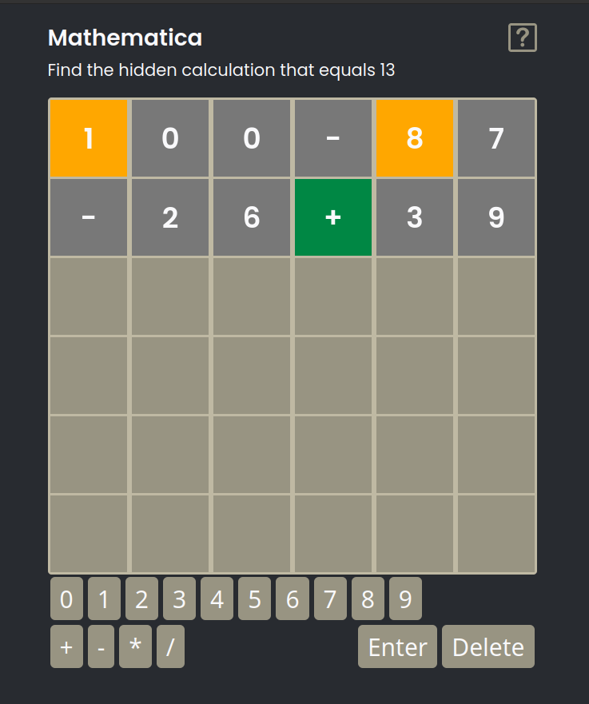

# Mathler Copy
Please take into account that I still work in this repository. It is a copy of the game "Mathler", which is a mathematical variation of the game "wordle". My main goal is to create an application without using third-party libraries, which will take up as little space as possible, while having a lot of fun. 

## Installing & Running
```
 npm install
 npm run build
 npm run preview
```

## Implementation

1. The mathler copy uses several CSS variables. Copy them to your CSS file.
```
  /* Header */
  --game-header-button-color: #989482;
  --game-header-hover-button-color: #bfb9a3;

  /* Board */
  --game-board-col-size: 64px;
  --game-board-col-text-size: 1.5rem;
  --game-board-background-color: #bfb9a3;
  --game-board-col-background-color: #989482;
  --game-board-result-correct: #008744;
  --game-board-result-different-place: #ffa700;
  --game-board-result-not-in-solution: #787878;

  /* Keyboard */
  --game-keyboard-button-text-color: #f9f9fb;
  --game-keyboard-button-background-color: #989482;
  --game-keyboard-button-hover-background-color: #bfb9a3;
  --game-keyboard-button-text-size: 1.25rem;
  --game-keyboard-button-padding: 8px;
  --game-keyboard-button-margin: 2px;
  --game-keyboard-button-radius: var(--border-radius);

  /* Notifications */
  --game-notification-background-color: #787878;
  --game-notification-border-radius: var(--border-radius);
  --game-notification-padding: 8px;
  --game-notification-text-size: 1rem;

  /* Dialog */
  --game-dialog-title-text-size: 1rem;
  --game-dialog-title-text-color: #000;

  --game-dialog-background-color: #bfb9a3;
  --game-dialog-border-radius: var(--border-radius);

  --game-dialog-button-radius: var(--border-radius);
  --game-dialog-button-text-color: #fff;
  --game-dialog-button-text-size: 0.875rem;
  --game-dialog-button-background-color: #989482;
  --game-dialog-button-hover-background-color: #bfb9a3;
```
2. Include builded javascript file in your apps `<head>`
3. Add `<math-game>` tag to your HTML.

## Next steps
- [ ] Requesting different solution each day
- [ ] Player stats
- [ ] E2E tests
- [ ] Improving frontend, making it more sexy (especially the game keyboard)
- [ ] Components communication refactor
- [ ] Bundle size reduction (DRY remove)

## License
MIT 2022 Mariusz Rakus (kolezka)